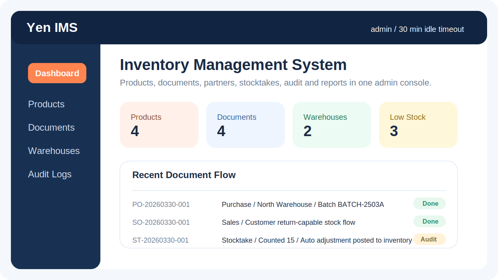
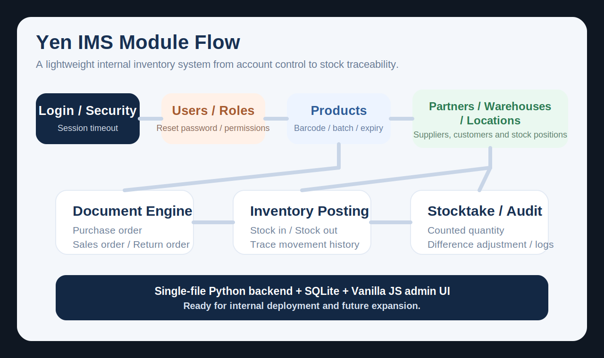
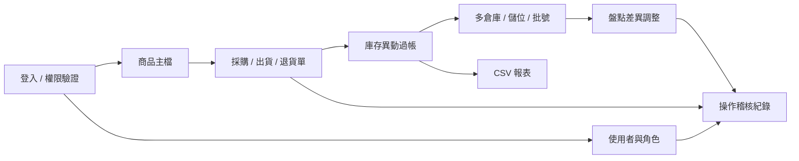

<div align="center">

# Yen IMS Website

輕量、可直接啟動的網頁版庫存管理系統。  
使用 `Python 標準函式庫 + SQLite + Vanilla JS`，適合內部後台、倉儲原型與中小型團隊快速部署。

<p>
  
  
  
  
</p>

</div>



## 專案簡介

這套系統已整合帳號權限、商品主檔、供應商與客戶、採購與出貨單據、多倉庫與儲位、盤點差異調整、操作稽核與報表匯出。  
目前版本不依賴第三方 Python 套件，啟動速度快，部署成本低，也保留後續升級到 `PostgreSQL` 或多明細單據架構的空間。

## 核心亮點

| 模組 | 已完成能力 |
| --- | --- |
| 帳號與安全 | 登入驗證、30 分鐘閒置登出、修改密碼、管理員重設密碼、強制首次改密碼 |
| 權限控制 | `admin`、`manager`、`operator`、`viewer`，並支援額外細部權限 |
| 商品管理 | 建立、編輯、停用、軟刪除、安全庫存、供應商綁定、條碼 / QR Code |
| 庫存控制 | 手動入庫 / 出庫 / 調整、庫存異動紀錄、低庫存提示 |
| 倉儲管理 | 多倉庫、多儲位、批號 / 序號 / 到期日欄位流轉 |
| 單據流程 | 採購單、出貨單、退貨單、完成後自動過帳到庫存 |
| 盤點 | 盤點數量輸入、自動計算差異並建立調整紀錄 |
| 管理稽核 | 操作稽核紀錄、CSV 報表匯出 |

## 介面預覽



## 系統流程



## 功能清單

- 登入頁與帳號密碼驗證
- 30 分鐘閒置自動登出
- 預設管理員帳號初始化
- 使用者自行修改密碼
- 管理員重設密碼，並強制使用者下次登入先改密碼
- 使用者管理、角色管理、額外權限設定
- 商品建立、編輯、停用、軟刪除
- 供應商與客戶資料管理
- 採購單、出貨單、退貨單
- 多倉庫與儲位管理
- 手動入庫 / 出庫 / 調整
- 盤點作業與差異調整
- 庫存異動紀錄
- 操作稽核紀錄
- 條碼 / QR Code 欄位管理
- 到期日、批號、序號欄位管理
- CSV 報表匯出

## 快速開始

### 1. 啟動系統

```bash
python3 app.py
```

啟動後開啟 [http://127.0.0.1:8080](http://127.0.0.1:8080)

如果要改 port：

```bash
PORT=9000 python3 app.py
```

如果要在內網提供其他電腦存取：

```bash
HOST=0.0.0.0 PORT=8080 python3 app.py
```

### 2. 預設管理員帳號

| 欄位 | 值 |
| --- | --- |
| 帳號 | `admin` |
| 密碼 | `Admin@123456` |

### 3. 系統資料位置

- SQLite 資料庫：`data/inventory.db`

## 內網部署建議

### 建議最少設定

```bash
HOST=0.0.0.0 \
PORT=8080 \
ALLOWED_NETWORKS=127.0.0.1/32,192.168.1.0/24 \
TRUSTED_HOSTS=localhost,192.168.1.50,ims-server.local \
python3 app.py
```

說明：

- `HOST=0.0.0.0`：讓內網其他電腦可以連進來
- `ALLOWED_NETWORKS`：只允許指定內網網段連線
- `TRUSTED_HOSTS`：只允許指定網址 / IP 當作 `Host`，降低 DNS rebinding 風險

### 已加入的內網安全保護

- `Host` 驗證
- 來源 IP 網段限制
- `Origin / Referer` 同源檢查，阻擋跨來源 POST
- 登入失敗節流，預設 10 分鐘內最多 5 次
- `HttpOnly` session cookie
- 安全標頭：`CSP`、`X-Frame-Options`、`X-Content-Type-Options`、`Referrer-Policy`
- API 回應預設 `Cache-Control: no-store`

### HTTPS 建議

這個專案本身仍是 `HTTP` 伺服器。  
如果要在公司內網正式使用，建議前面加 `Nginx` 或 `Caddy` 做 `HTTPS` 反向代理，再啟用：

```bash
TRUST_PROXY_HEADERS=1 FORCE_SECURE_COOKIES=1 python3 app.py
```

這樣在代理層用 TLS，加上後端 session cookie 也會自動帶 `Secure`。

## 權限設計

| 角色 | 說明 |
| --- | --- |
| `admin` | 完整權限，含使用者管理、重設密碼、刪除商品、稽核與匯出 |
| `manager` | 偏營運管理，預設不含使用者管理與密碼重設 |
| `operator` | 偏庫存與單據作業 |
| `viewer` | 僅檢視資料 |

額外權限可依人員需求追加，例如：

- `view_audit`
- `export_reports`
- `delete_products`
- `reset_passwords`

## 目前第一版限制

- 報表匯出目前提供 `CSV`；若要真正的 `Excel (.xlsx)`，需要再加檔案格式產生器
- 條碼 / QR Code 目前支援欄位與掃碼槍輸入，相機掃描尚未接入
- 採購單、出貨單、退貨單目前為單筆商品單據，尚未擴充為多明細 ERP 單據
- 刪除商品為軟刪除，不會直接從資料庫永久移除
- 序號目前支援欄位記錄，尚未做到一物一序號的唯一性鎖定

## 已驗證項目

- `python3 -m py_compile app.py`
- `node --check static/app.js`
- 管理員登入與 30 分鐘 session 設定
- 管理員建立使用者、角色與額外權限
- 管理員重設密碼，使用者下次登入需先改密碼
- 商品建立、編輯、停用、刪除
- 供應商、客戶、倉庫、儲位建立
- 採購入庫、出貨、退貨、盤點差異調整
- 批號 / 到期日資料隨庫存流轉
- 稽核紀錄與 CSV 匯出

## 後續可擴充方向

- 真正的 `Excel (.xlsx)` 匯出
- 瀏覽器相機條碼 / QR Code 掃描
- 多明細單據與簽核流程
- PostgreSQL / MySQL 遷移
- 圖表化儀表板與趨勢分析
